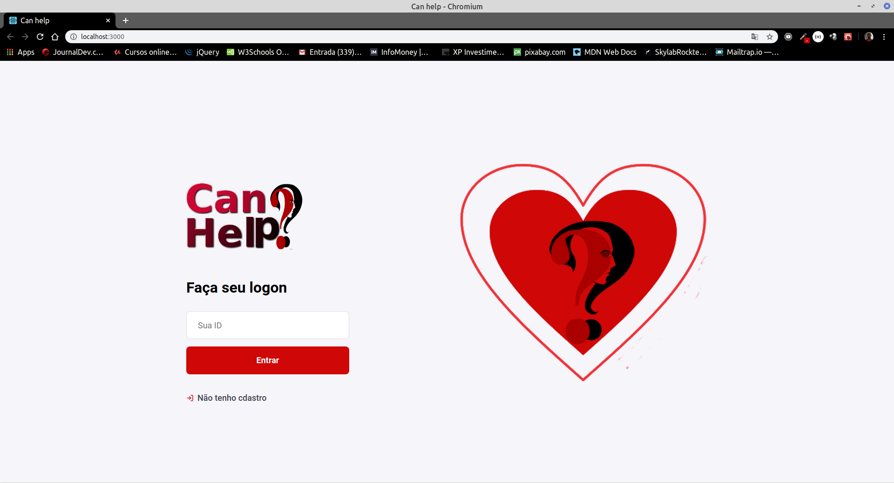
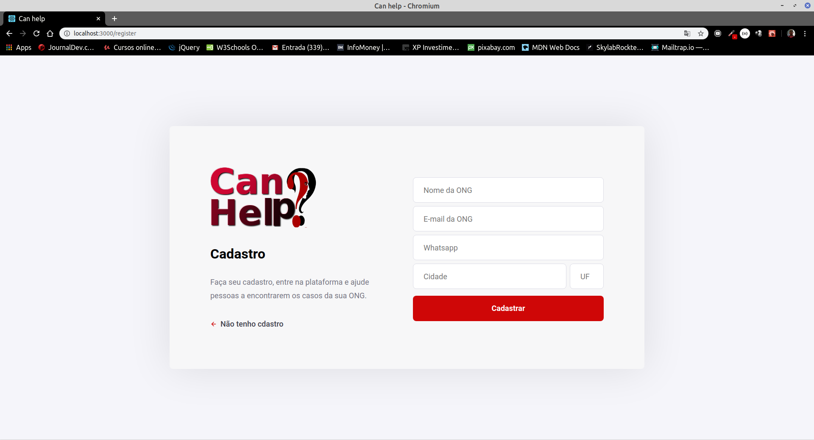
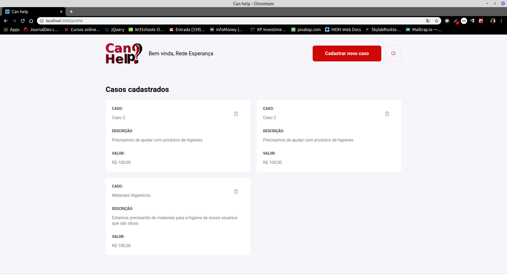
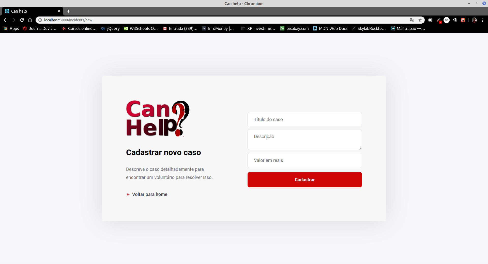

<!DOCTYPE html>
<html lang="en">
<body>
  <h1></h1>
  
Essa é uma aplicação voltada para punho social,  a ideia é disponibilizar 
    para ONGs que não tem como comprar um sistema. 
  

  <h2>Apresentando o Sistema</h2>
  
Como funciona: 
     por exemplo as ONGs se registrar na plataformar  para poder solicitar 
    ajude de voluntários que se sensibiliza com sua causa 

  <h2>Tela de login</h2>
  
  
Que após a ONG se registrar na plataforma será gerado um ID que dará acesso a mesma

  <h2>Tela de registro</h2>
  
  
Caso não tenha cadastro registre-se

  <h2>Tela de boas vindas</h2>
  
  
Após registrada a ONG poderá fazer seu login e ter acesso a pagina home da aplicação

  <h2>Tela de novos casos</h2>
  
  
Depois de já ter se registrado e logado na aplicação  a ONG em questão poderá registrar os caso em que precisa de ajuda

</body>
</html>