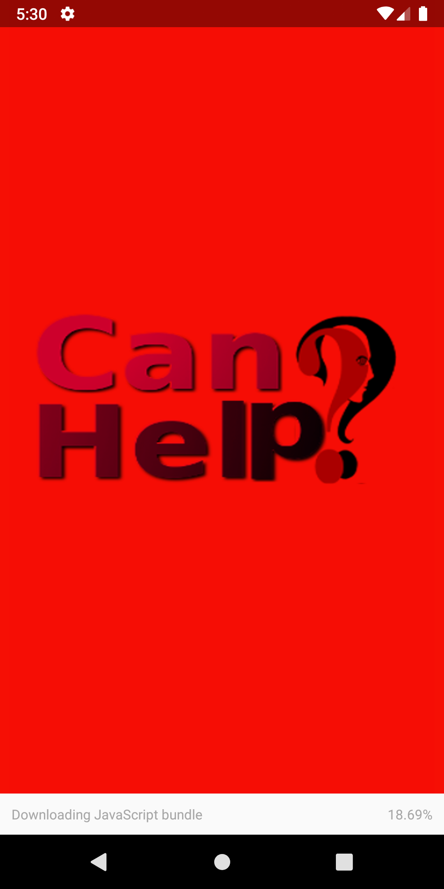

<html lang="en">
<body>
  <h1>App </h1>

  
Aplicação desenvolvida em  <a href="https://react-native.org/" target="_blank">React Native</a>, 
    com uso das tecnologia do <a href="https://expo.io/" target="_blank">EXPO</a>, que serve para rodar a Aplicação 
    sem a necessidade de ter que baixar a SDK do android, 
    pois o EXPO ja faz todo o trabalho.
  

  <h2>Telas do App</h2>
  
 
    splash do APP.
  

  
  Casos das ONGs

  
 Caso detalhado

  
</body>
</html>